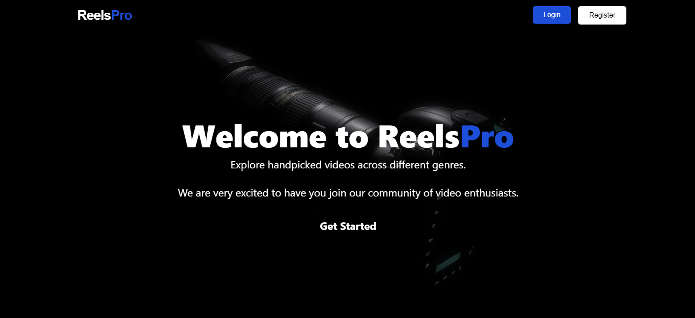

# ReelsPro

## 📌 Project Overview

🎬 About ReelsPro

ReelsPro is a dynamic web application that allows users to upload, view, and interact with short video reels shared by other users. The platform is designed to create an engaging experience where creativity thrives, fostering a community-driven environment for content creators and viewers alike.

## 🖼️  Preview



## 🚀 Features

- **User-friendly interface** for seamless feedback submission
- **Upload and rendering videos** using Imagekit 
- **Authentication system** using NextAuth
- **Mobile-responsive design** ensuring accessibility across devices
- **Optimized performance** with server-side rendering (SSR) and static site generation (SSG)
- **Modern UI** powered by Tailwind CSS and Shadcn, magicui
- **Secure API interactions** for data integrity

## 🔗 Live Demo

Check out the live version of ReelsPro here: [Live Site](https://reelspro-phi.vercel.app/)

## 🛠 Installation & Setup

To set up and run the project locally, follow these steps:

### Prerequisites

Ensure you have the following installed:

- **Node.js** (Latest LTS version recommended)
- **npm** or **yarn** for package management
- A **MongoDB database**

### Steps to Run

1. **Clone the repository:**
   ```sh
   git clone https://github.com/Sankalp20Tiwari/reelsPro.git
   ```
2. **Navigate to the project directory:**
   ```sh
   cd reelsPro
   ```
3. **Install dependencies:**
   ```sh
   npm install  # or yarn install
   ```
4. **Configure environment variables:**
   Create a `.env` file in the root directory and define the necessary environment variables:
   ```sh
   NEXTAUTH_SECRET=<your-next-auth-secret>
   MONGODB_URI=<your-database-connection-string>
   NEXT_PUBLIC_PUBLIC_KEY=<your-imagekit-next-api-key>
   IMAGEKIT_PRIVATE_KEY=<your-imagekit-private-api-key>
   NEXT_PUBLIC_URL_ENDPOINT=<your-imagekit-url-endpoint>
   ```
5. **Run the development server:**
   ```sh
   npm run dev  # or yarn dev
   ```
6. Open `http://localhost:3000` in your browser to view the application.

## 🔧 Configuration

The application uses environment variables to manage API endpoints and database connections. Update the `.env` file accordingly to ensure smooth functionality.

## 📂 Project Structure

```
reelsPro/               
   ├──app/             
       ├──(app)/       # Pages of application
       ├──(auth)/      # Auth related pages
       ├──(api)/       # Auth and other APIs
       ├──components/  # Reusable custom made components
       ├──layout.tsx   # Layout page
       ├──page.tsx     # Actual Landing Page
   ├──components/      # Reusable UI components from shadcn and magicui
   ├──data/            # Data used at various places
   ├──lib              # Utilities
   ├──models            # Models            
   ├── public/            # Static assets (images, icons, etc.)
   ├── next.config.ts     # Next.js configuration settings
   ├── package.json       # Project metadata and dependencies
   ├── .env               # Environment variables (excluded from Git)
```

## 🏰 Technologies Used

- **Next.js** - React framework for SSR & SSG
- **TypeScript** - Ensures type safety and scalability
- **Imagekit** - Uploading and management of videos using imagekit
- **MongoDB** - Database solutions for storing feedback
- **Tailwind CSS** - Utility-first CSS framework for rapid styling
- **ESLint & Prettier** - Code linting and formatting for better maintainability
- **JWT Authentication** - Secure user authentication using NextAuth.js
- **React-hook-form** - All forms are managed using React Hook Form
- **Shadcn** - Responsive and clean UI with help of Shadcn


## 🤝 Contributing

We welcome contributions to enhance the project! To contribute:

1. Fork the repository.
2. Create a new branch (`feature/your-feature-name`).
3. Implement your changes and commit.
4. Push to your forked repository and submit a pull request.


